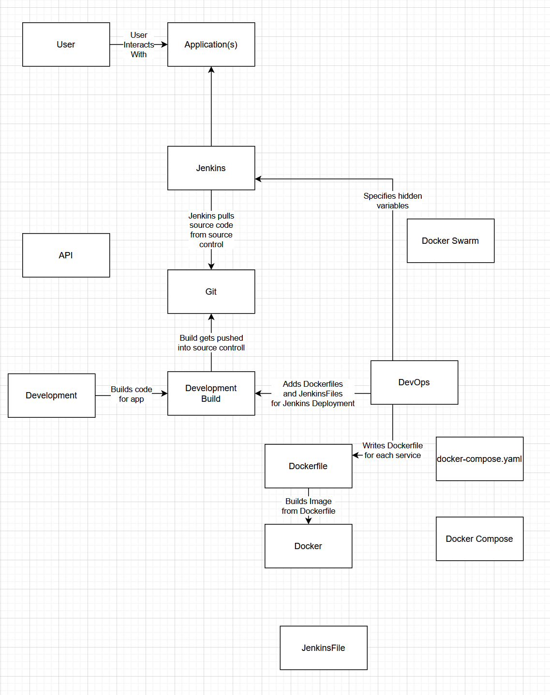
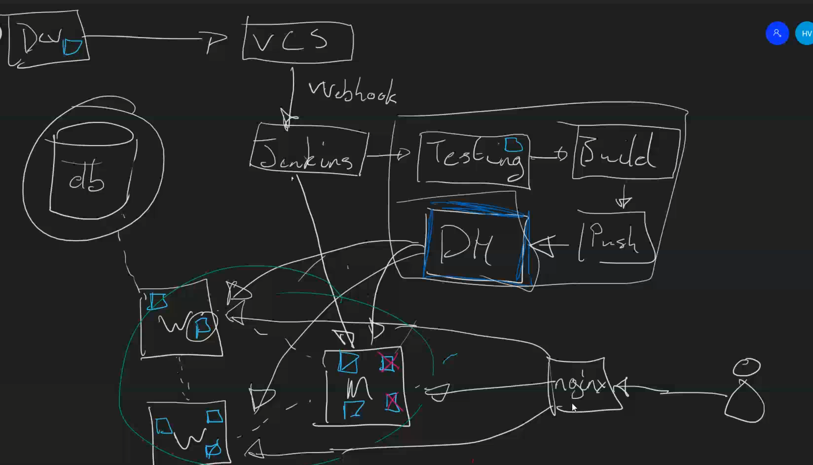
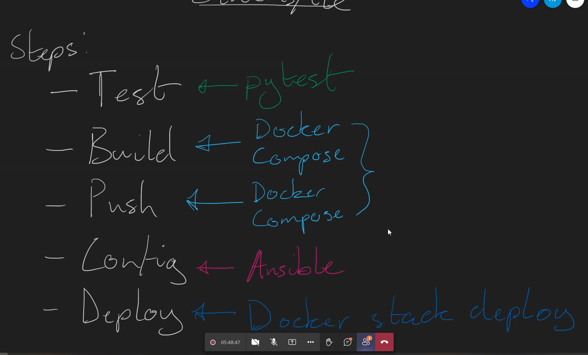
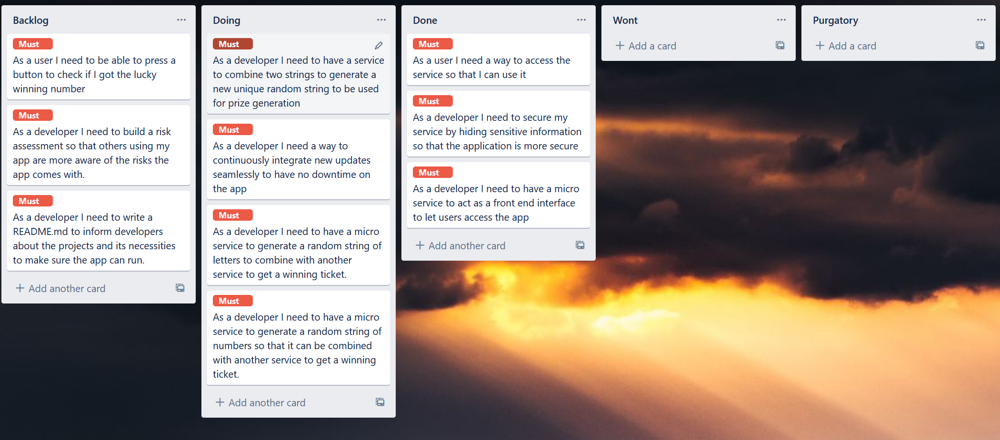
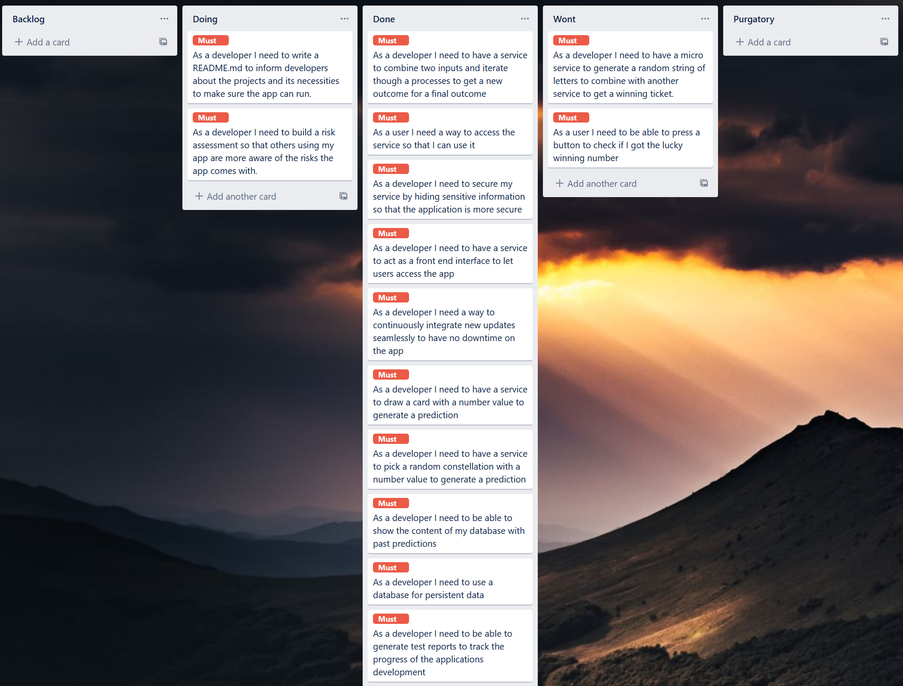

# Old Gypsy


Old Gypsy is a micro service app that randomises some responses and returns them to create a basic perdiction and logs it into a remote database.

## Tools Used

* Trello
* Visual Studio Code
* Python
* Jenkins
* Gunicorn
* Flask
* Ubuntu 
* GCP
* Ansible
* Docker
* Docker-compose
* Docker Swarm
* Nginx


## Functionality

The app has four services that all connect to each other through the frontend which interacts between them and a remote database.

<details>
<summary> s4-tarot-cards </summary>
This is a service that has a randomiser that reads from a json file and picks a card at random formats it then send it back when it is called through its api. The number is gathered from a random range based on the variable that is passed in so it could work with things such as strings and other objects however it would fail if it does not consist of a structure that has key value pairs such as a dictionary since it loops through all the keys that it can find then using that as the basis for picking a random card.
</details>

<details>
<summary>s3-constalations </summary>
Like s4 this uses a randomiser but instead it picks from a list of dictionaries then by treating hte dictionary, that was chosen at random using a similar techinque from s4, like a list it makes it easier to turn the data picked into a response by converting it back into a dictonary once the data that was required is extracted from the list.
</details>

<details>
<summary> s2-combination </summary>

This is a service that uses the results of service 4 and 3 once the data is passed to it from service 1 through a post api call where it uses weights associated with the previously chosen values to itterate and create a luck value multiplying the weight with random values before formating it again and sending it back to service 1. At each stage of the itterative procces it also clamps the generation to not go over 20 or to 0 so that the change of the luck value doesnt change too out of scale.
</details>

<details>
<summary> s1-front-end </summary>

This service uses all the other services to get a combination of results to determine the fortune of a user based on the luck that was generated in the itterative process in service 2. Since the generation is favored to dimish the starting value good fortunes are given at only 50% the maximum value, since adding 50% and subtracting 50% have different results as subtracting 50% has a more negative impact. 

The service then adds the values generated with each fortune to a database which can be viewed on another page that is linked that shows all the values in the order: card name, card weight, constalation name, constalation weight, luck, fortune.
</details>

<details>
<summary> General </summary>

The services were built to be small products that dont have a lot to them and for convenience the routes models and various aspects were not separated into separate scripts should you wish to expand on this I sugguest moving the models and routes into individual scrips and importing them into each project to access them but since they have mostly 2 routes and 1 model per service I thought it would make it more convineat to read and view.
</details>

## Deployment

This app is build with a CI Jenkins pipeline allowing you to have the app be continuasly deployed with rolling updates and little downtime. To set up link your Jenkins server up to the repo you wish to use and add in the secret text for your database uri under the id "gcp-db-uri" thought htis is not gcp exclusive, you will also need to jenkins a few privalages and ability to run some commands.

### Jenkins privalages

#### Requirements

You will need to install the following on jenkins 
* docker
* docker-compose
* ansible 

You will need to give jenkisn the following credential secret text
* gcp-db-uri
for any help with doing this go to the jenkins credential documentation

You can also use this link
[Jenkins Credentials Documetnation](https://www.jenkins.io/doc/book/using/using-credentials/)

#### SSH

To use the swarm that comes with this app you would need a few other machines called the following unless you want to change the ansible/inventory.yaml file

* swarm-master
* swarm-worker
* swarm-worker2
* nginx-rplb

These machines need Jenkins' public ssh key so that jenkins can connect to them adn exectue commands for deployment.

#### Permisions

Within visudo give jenkins the ability to run 

* /usr/bin/apt-get update
* /usr/bin/apt-get install -y python3-venv python3-pip

You will also need to add jenkisn to your docker group if you haven't already

```
sudo usermod -a -G docker jenkins
```

After all this if it doesn't work yet you might need to turn jenkins machine off and back on

### Rolling Updates

For isntant updates the repository needs to have a webhook attached to the jenkins server so you would need to use your own clone of this repo where you  would add a webhook to your jenkins server. Other than that the server should just roll out updates if they pass all the stages of the pipeline.

## Risks
| Risk  | Danger | Precaution |
|   :----:    |    :----:    | :----: |
| SQL injection        | Low         | The database URI is securly hidden behind your jenkisn server and the user has no direct acces to the database through the application |
| Running out of credit        | High         | My GCP credit for this projcet almost ran out so to help finish the project I had started another trial to finish up with GCP and to have enough credits to host the app, please note that SQL databases use up a considerable sum of credit to maintain for when you use this project | 
| Database storage attack | Medium-High | The app adds an entry with each visit to the website there are no precautions against this but to combat it it can be turned into a form, it is a big threat because should it happen the databse storage could go up rapidly if the application doesnt go down which could stack up a high bill | 
| Age Apropriate | Medium | Due to some belief that fortune telling is not apropriate for children it may be regarded as unfit for the audience to combat this I sugguest chanigng the theme for your project to include friendlier themes |
| Validity | Low | Though some people believe in predictions and fortune telling this has very little in resemblence with any fortune telling other than the theme a disclamer might help enlighten visitors to its nature however |
| Unintended Access | Low-Medium| The app is hidden behind a nginx reverse proxy and requires none of the services to be exposes in anyway however the app doesn't offer much in protection in any other way so I sugguest adding in some of your own firewall rules and some personal security for additional protection |

## Tests

97%-98% coverage

There is a high test coverage with little tests in this project to the minimalistic nature of it since if a route return 200 it has worked correctly and in genral little deviation is possible.


## Project Development

I began the project with outlining the proces of the build pipeline to help me matrialise the proces as I had a faint understanding of what a finished product would look like, before I could finish I was shown some diagrams and Harry Volker but I will showcase all the diagrams I used before starting. 




Afterwards I set out to make my kanban board ( look into changes to requirements ) before making my machines and trying t oget a basic app going to build the CI pipeline and then finishing off the project. During development I learned a lot about responses and mocking api responses for testing and how they worked mostly through trial and error seeing how little changes could influence the outcome. This had led me to make a script (not included in the repo) to bust push changes to a branch to quickly see the change on Jenkins since I was new to this I was interested in figuring out how it all works.

### Changes to requirements

The origina project going to be a prize generator and as I was working on the app I realised that it wouldn't take much and change the theme of the project. I did this to try to make my project stand out a bit more since this was developed alongside a cohort who seemed to mostly make some prize generator. Though the proejct would still be similar it wouldn't be the same to give me a more unique feel and motivate me on the project.


The new project ended up working as expected similar and not too different where I would have to start over from the start allowing me to reuse a lot of the code that I had already built for my new purpose.


## References

QA Community 

Dara Oladapo

Harry Volker