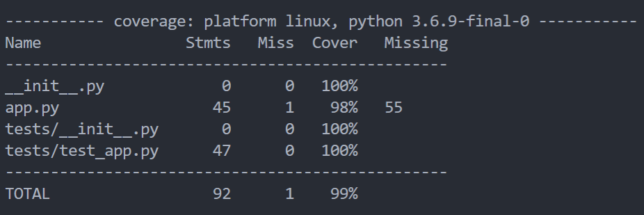
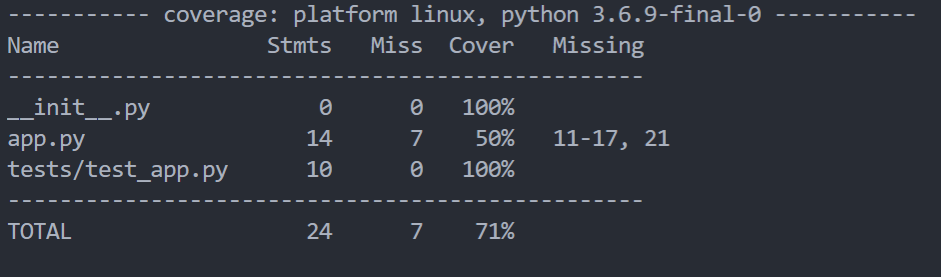
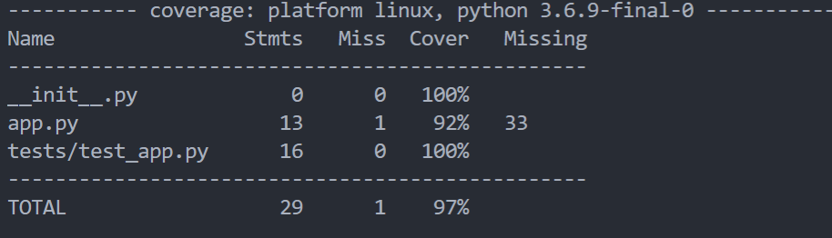
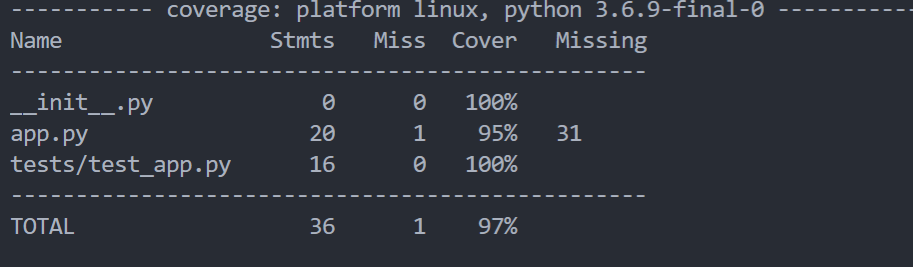
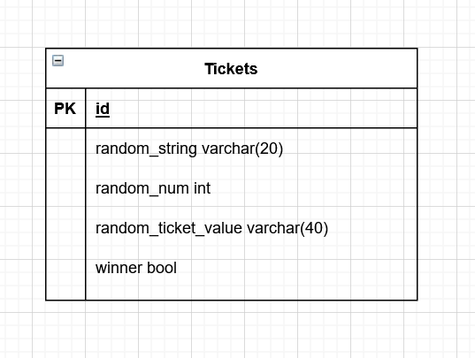
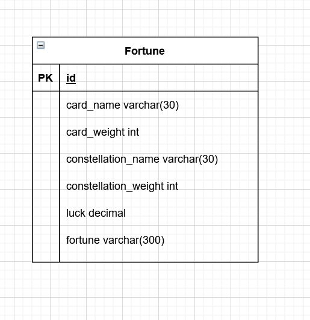

# Old Gypsy


Old Gypsy is a microservice app that randomises some responses, returns them to create a basic prediction, and logs it into a remote database.

## Tools Used

* Trello
* Visual Studio Code
* Python
* Jenkins
* Gunicorn
* Flask
* Ubuntu 
* GCP
* Ansible
* Docker
* Docker-compose
* Docker Swarm
* Nginx


## Functionality

The app has four services connected through the frontend, which interacts between them and a remote database.

<details>
<summary> s4-tarot-cards </summary>
This service has a randomiser that reads from a JSON file and picks a card at random formats it then sends it back when it is called through its API. The number is gathered from a random range based on the variable that is passed in so it could work with things such as strings and other objects; however, it would fail if it does not consist of a structure that has key-value pairs such as a dictionary since it loops through all the keys that it can find then using that as the basis for picking a random card.
</details>

<details>
<summary>s3-constalations </summary>
Like s4, this uses a randomiser but instead, it picks from a list of dictionaries then by treating the dictionary that was chosen at random using a similar technique from s4, like a list it makes it easier to turn the data picked into a response by converting it back into a dictionary once the data that was required is extracted from the list.
</details>

<details>
<summary> s2-combination </summary>

This is a service that uses the results of service 4 and 3 once the data is passed to it from service 1 through a post API call where it uses weights associated with the previously chosen values to iterate and create a luck value multiplying the weight with random values before formating it again and sending it back to service 1. At each stage of the iterative process, it also clamps the generation not to go over 20 or 0 so that the luck value change doesn't change too out of scale.
</details>

<details>
<summary> s1-front-end </summary>

This service uses all the other services to get a combination of results to determine the fortune of a user based on the luck generated in the iterative process in service 2. Since the generation is favoured to diminish the starting value, good fortunes are given 50% the maximum value, since adding 50% and subtracting 50% have different results as subtracting 50% has a more negative impact. 

The service then adds the values generated with each fortune to a database which Who can view on another page that is linked that shows all the values in the order: card name, card weight, constellation name, constellation weight, luck, fortune.
</details>

<details>
<summary> General </summary>

The services were built to be small products that don't have a lot to them, and for convenience, the routes models and various aspects were not separated into separate scripts. Should you wish to expand on this, I suggest moving the models and routes into individual scrips and importing them into each project to access them, but since they have mostly 2 routes and 1 model per service, I thought it would make it more convenient to read and view.
</details>

## Deployment

This app is built with a CI Jenkins pipeline allowing you to have the app be continuously deployed with rolling updates and little downtime. To set up, link your Jenkins server up to the repo you wish to use and add in the secret text for your database URI under the id "GCP-DB-URI". However, this is not GCP exclusive, you will also need to Jenkins a few privileges and ability to run some commands.

### Jenkins privileges

#### Requirements

You will need to install the following on Jenkins 
* docker
* docker-compose
* ansible 

You will need to give Jenkins the following credential secret text
* GCP-DB-URI
for any help with doing this, go to the Jenkins credential documentation

You can also use this link.
[Jenkins Credentials Documetnation](https://www.jenkins.io/doc/book/using/using-credentials/)

#### SSH

To use the swarm that comes with this app, you would need a few other machines called the following unless you want to change the ansible/inventory.YAML file

* swarm-master
* swarm-worker
* swarm-worker2
* Nginx-reply

These machines need Jenkins' public ssh key so that Jenkins can connect to them and execute commands for deployment.

#### Permisions

Within visudo give Jenkins the ability to run. 

* /usr/bin/apt-get update
* /usr/bin/apt-get install -y python3-venv python3-pip

You will also need to add Jenkins to your docker group if you haven't already.

```
sudo usermod -a -G docker Jenkins
```

After all, if it doesn't work yet, you might need to turn the Jenkins machine off and back on.

### Rolling Updates

For rolling updates, the repository needs to have a webhook attached to the Jenkins server, so you would need to use your own clone of this repo where you would add a webhook to your Jenkins server. Other than that, the server should roll out updates if they pass all the pipeline stages.

## Risks
| Risk  | Danger | Precaution |
|   :----:    |    :----:    | :----: |
| SQL injection        | Low         | The database URI is securely hidden behind your Jenkins server, and the user has no direct access to the database through the application |
| Running out of credit        | High         | My GCP credit for this project almost ran out, so to help finish the project, I had started another trial to finish up with GCP and to have enough credits to host the app, please note that SQL databases use up a considerable sum of credit to maintain for when you use this project | 
| Database storage attack | Medium-High | The app adds an entry with each visit to the website. There are no precautions against this, but to combat it, it can be turned into a form. It is a big threat because should it happen, the database storage could go up rapidly if the application doesn't go down, which could stack up a high bill | 
| Age Appropriate | Medium | Due to some belief that fortune-telling is not appropriate for children, it may be regarded as unfit for the audience to combat this, I suggest changing the theme for your project to include friendlier themes |
| Validity | Low | Though some people believe in predictions and fortune-telling, this has very little in resemblance with any fortune-telling other than the theme a disclaimer might help enlighten visitors to its nature; however |
| Unintended Access | Low-Medium| The app is hidden behind an Nginx reverse proxy and requires none of the services to be exposed in any way; however, the app doesn't offer much protection in any other way, so I suggest adding in some of your own firewall rules and some personal security for additional protection |
| Accessibility | High | The application only works for English reading individuals since it has no translation or localisations |
| Scalability | High | The application has multiple machines associated with spreading the load with loadballencers. Still, it doesn't scale out or up when it needs to mean that an influx of traffic will eventually crash the site. The current solution is to add more machines manually | 

## Tests

90%-99% coverage

There is a high test coverage with few tests in this project to the minimalistic nature of it since if a route return 200, it has worked correctly and in general little deviation is possible. The large gap in service 2 testing is due to me being unable to find a way to mock a post request to get the JSON file over; the total test coverage is 90-99% as soon as I find a way to mock this request.






## Project Development

I began the project by outlining the process of the build pipeline to help me materialise the process as I had a faint understanding of what a finished product would look like; before I could finish, I was shown some diagrams and Harry Volker, but I will showcase all the diagrams I used before starting. 


Afterwards, I set out to make my kanban board ( look into changes to requirements ) before making my machines and trying t get a basic app going to build the CI pipeline and then finishing off the project. During development, I learned a lot about responses and mocking API responses for testing and how they worked mostly through trial and error, seeing how little changes could influence the outcome. This had led me to make a script (not included in the repo) to bust push changes to a branch to see the change on Jenkins quickly. Since I was new to this, I was interested in figuring out how it all works.

### Changes to requirements

The original project will be a prize generator, and as I was working on the app, I realised that it wouldn't take much and change the theme of the project. I did this to try to make my project stand out a bit more since this was developed alongside a cohort who seemed to make some prize generator mostly. Though the project would still be similar, it wouldn't be the same to give me a unique feel and motivate me.


The new project ended up working as expected, similar and not too different where I would have to start over from the start allowing me to reuse a lot of the code that I had already built for my new purpose.


### Changes to database table diagrams






## References

QA Community 

Dara Oladapo

Harry Volker